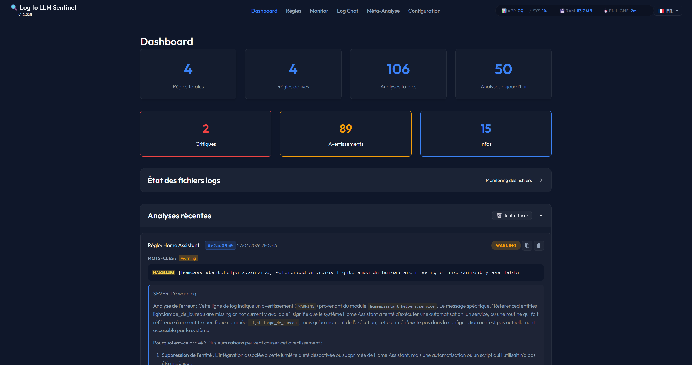
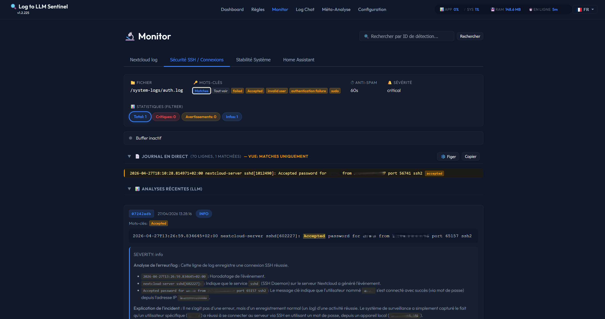
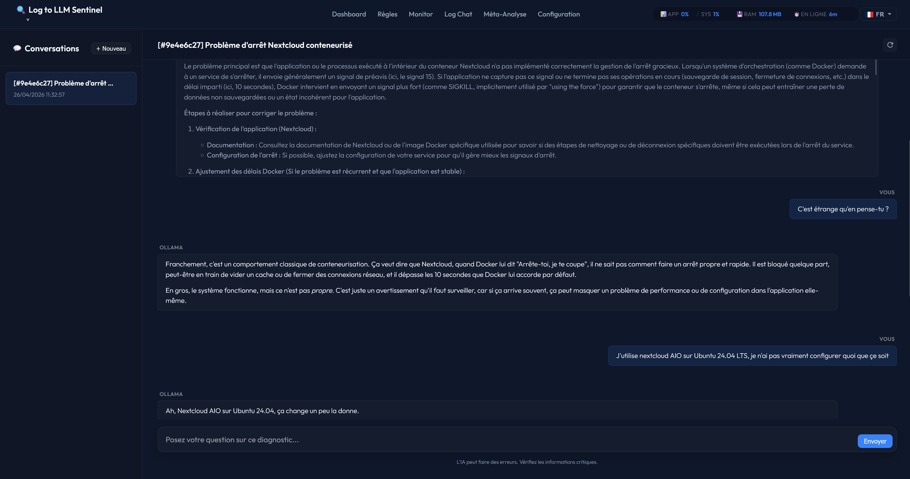
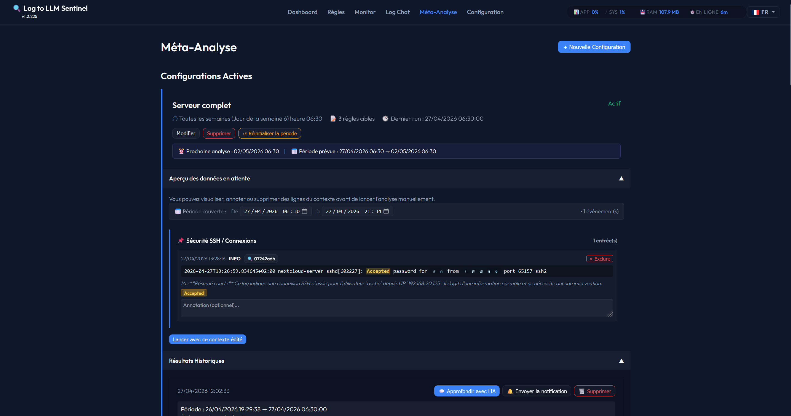
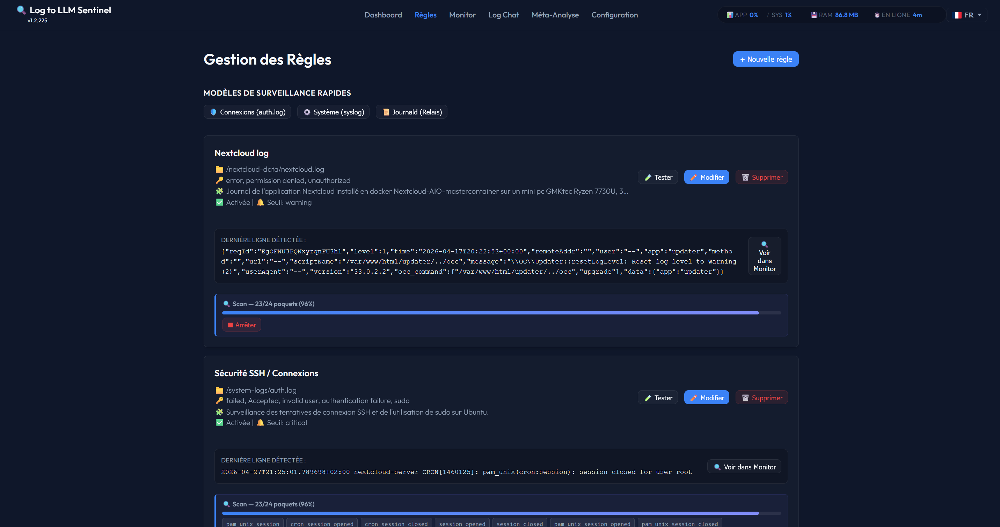
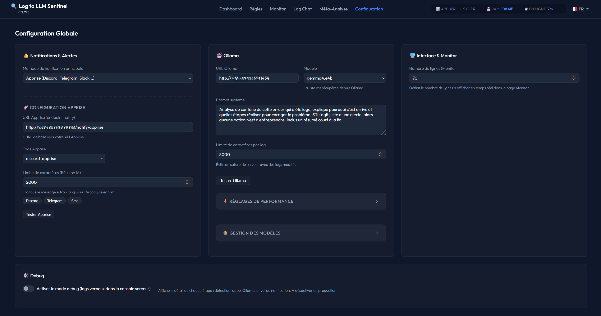

# 🛡️ Log to LLM Sentinel

**Your intelligent log guardian powered by Local AI.**

Log to LLM Sentinel is a modern, lightweight, and powerful log monitoring tool. Unlike traditional tools that just search for text, Sentinel uses **Ollama (Local LLM)** to understand *why* an error happened and tells you exactly what you need to know.

<p align="center">
  
  
  
  
  
  
</p>

---

## ✨ Key Features

- 🧠 **Smart AI Analysis**: Don't just get alerted; get an explanation. Sentinel uses Ollama to analyze log context and provide a human-readable diagnosis.
- 🤖 **Keyword Auto-Learning**: Not sure what to look for? Let the AI scan your historical logs. It will automatically suggest and validate the most important keywords to monitor.
- 🔗 **Home Assistant Ready**: Use Webhooks to stream logs from your smart home directly to Sentinel.
- 🔔 **Universal Notifications**: Get alerted via Discord, Telegram, Slack, or Email thanks to built-in Apprise support.
- 🌍 **Fully Multilingual**: Beautiful interface available in **English** and **French**.
- 🔒 **100% Private**: Everything runs locally on your machine. No data ever leaves your network.

---

## 🚀 Quick Start (For Non-Experts)

The easiest way to run Sentinel is using **Docker**. This ensures all components (Database, Web Server, and AI) work together perfectly.

### 1. Prerequisites
- Install [Docker Desktop](https://www.docker.com/products/docker-desktop/) (Windows/Mac) or Docker Compose (Linux).
- (Optional) Install [Ollama](https://ollama.com/) locally to use your GPU.

### 2. Get the files
Either **Clone** this repository or **Download** the project as a ZIP and extract it on your computer.

```bash
git clone https://github.com/Aschefr/log-to-llm-sentinel
cd log-to-llm-sentinel
```

### 3. Generate your Configuration
Download the file by right clicking **[docker-setup.html](docker-setup.html)** and select "Save link as")

We provide a visual tool to help you create your `docker-compose.yml` file:

1. **Open it with your favorite web browser** (Chrome, Firefox, Edge...).
2. Select your options (Port, Log folders, AI mode).
3. Copy the generated YAML code.
4. Open the existing **`docker-compose.yml`** file in your project folder, delete its content, and paste your custom code.

### 4. Launch the Sentinel
Open a terminal in your project folder
```bash
cd ~/log-to-llm-sentinel
```
Then run:

```bash
docker-compose up -d
```

### 5. Access the Interface
Once the containers are started, open your browser and go to the port you chose (default is 10911):
👉 **[http://localhost:10911](http://localhost:10911)**

#### 🤖 AI Configuration Note
- **Internal Ollama**: If you chose the "Internal" mode in the configurator, Sentinel is already pre-configured to talk to its own AI engine.
- **External Ollama**: If you use an existing Ollama install, you will need to enter its address (e.g., `http://192.168.x.x:11434`) in the **Configuration** page of the Sentinel UI.
- **Important**: This project is designed for **Local AI only**. It currently does **not** support external cloud APIs like ChatGPT, Claude, or Gemini.

---

## 📖 How it Works

1. **Define a Rule**: Point Sentinel to a log file or a Webhook token.
2. **Set Keywords**: Choose which words should trigger an alert (e.g., `error`, `failed`, `critical`).
3. **AI Kick-in**: When a match is found, Sentinel grabs the surrounding lines and sends them to your local AI.
4. **Get Notified**: You receive a notification with a summary of the situation and the AI's diagnosis.

### 💡 The "Auto-Learning" Magic
Setting up keywords can be tedious. Use the **Auto-Learning Wizard**:
- Select a time period (e.g., "The last 24 hours").
- Sentinel will "read" your logs in chunks.
- It identifies recurring errors and asks the AI to refine a list of "Actionable Keywords."
- **Result**: A perfectly tuned monitoring rule in minutes, not hours.

---

## 🏠 Home Assistant Integration

Sentinel is designed to play well with Home Assistant. You can send your HASS logs via Webhook:

1. Create a **Webhook Rule** in Sentinel to get a unique token.
2. In Home Assistant, add a REST command to forward your `system_log_event`.
3. Sentinel will now monitor your smart home in real-time!

---

## 🛠️ Configuration

Sentinel is highly customizable via the **Configuration** page:
- **AI Model**: Choose your favorite model from Ollama (Gemma, Llama 3, Mistral...).
- **Performance**: Adjust "Eco" or "GPU" profiles depending on your hardware.
- **Privacy**: Fine-tune anti-spam delays and sensitivity thresholds.

---

## 🤝 Support & Contribution

If you encounter an issue or have a suggestion, feel free to open an issue on the repository. 

**Log to LLM Sentinel** — *Because logs are meant to be understood, not just stored.*
